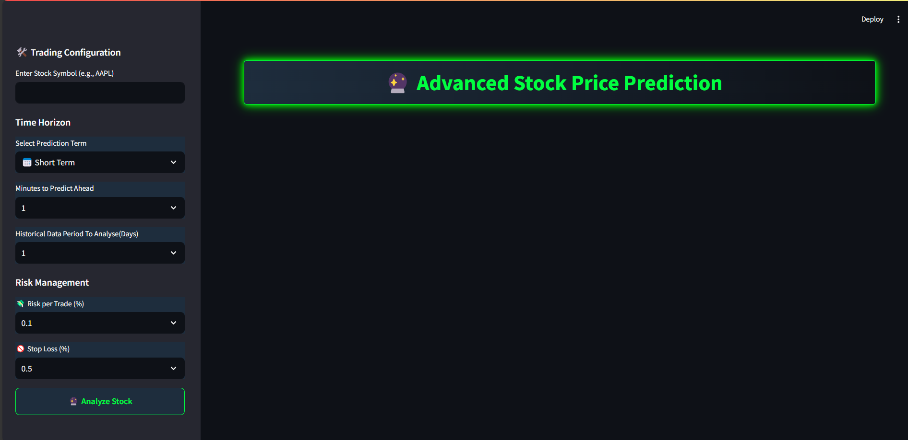
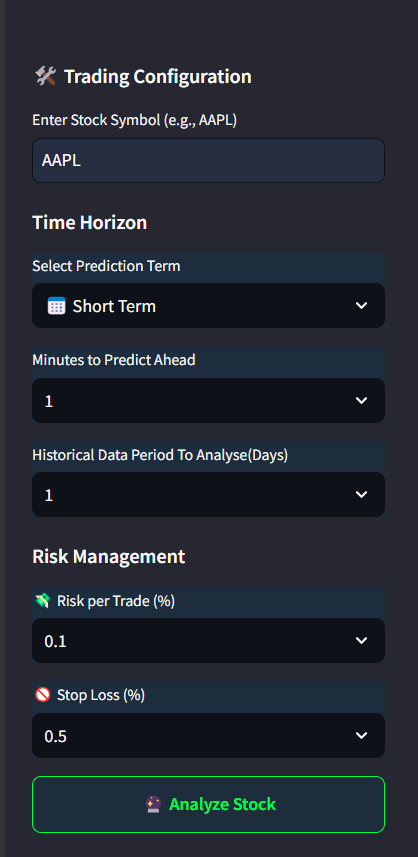
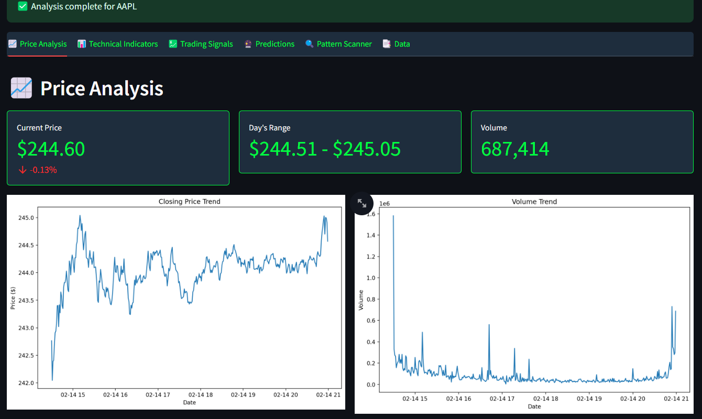
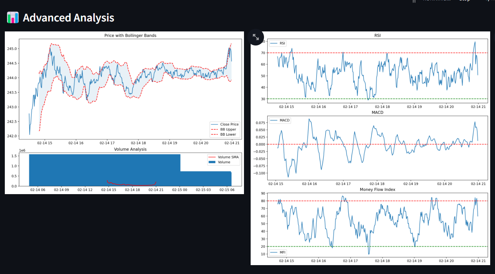
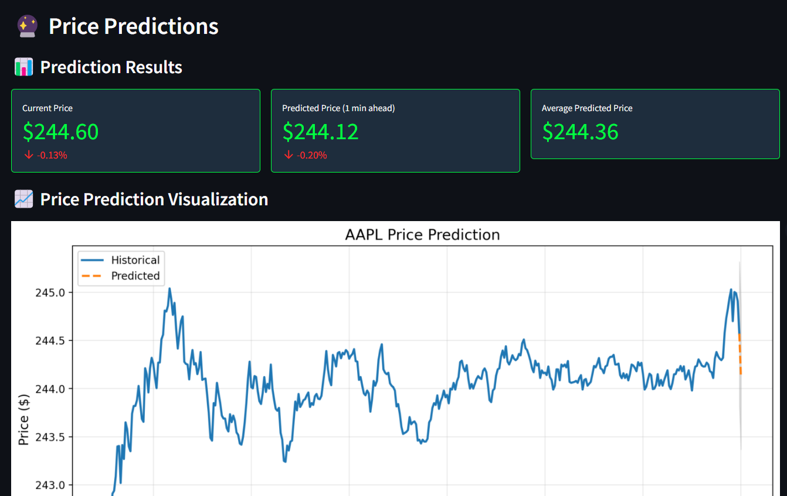
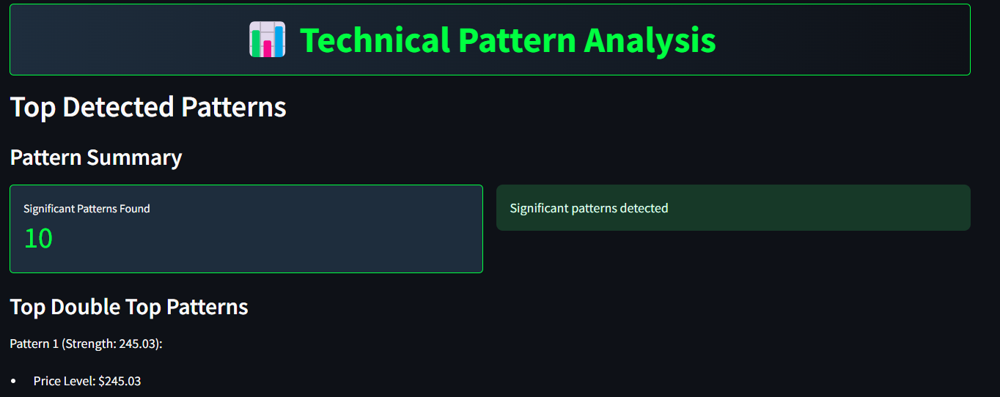
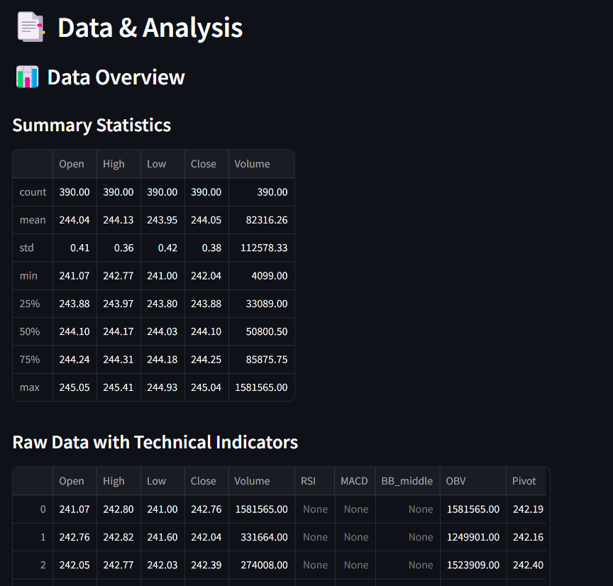

# 🔮 Advanced Stock Price Prediction Pro

A cutting-edge stock analysis and prediction platform that integrates AI, real-time market insights, and portfolio management.

## 🚀 Live Demo  
👉 **[Access the Application](#)** 

---

## 🌟 Key Features  

### ✅ User Interface  
  
A sleek and intuitive UI for seamless stock analysis.  

### ✅ Stock Input Section  
  
Enter stock symbols, set time horizons, and configure risk settings.  

### ✅ Graphical Price Analysis  
  
Interactive price charts to visualize stock trends.  

### ✅ Advanced Data Analysis  
  
Detailed insights into stock movement and behavior.  

### ✅ Technical Indicators  
  
Includes RSI, MACD, Bollinger Bands, Moving Averages, and more.  

### ✅ Trading Signals  
  
AI-driven buy, sell, and hold signals for smarter trading decisions.  

### ✅ AI-Based Predictions  
  
Predictions using models like SVM, KNN, Decision Trees, and XGBoost.  

### ✅ Pattern Recognition  
  
Identifies patterns such as Head & Shoulders, Double Tops, and Triangles.  

### ✅ Portfolio & Risk Management  
  
Manage holdings, track investments, and calculate stop-loss.  

### ✅ Stock Data Statistics  
  
Comprehensive stock market statistics and insights.  

---

## 📊 How It Works  
1️⃣ **Enter Stock Symbol** – Type in a stock symbol (e.g., AAPL for Apple).  
2️⃣ **Select Time Horizon** – Choose between short-term, mid-term, or long-term analysis.  
3️⃣ **Risk Management Settings** – Adjust stop-loss and position sizing.  
4️⃣ **Click “Analyze Stock”** – Get predictions, signals, and statistical insights.  

---

## 🛠 Technologies & Tools Used  

### 🚀 Application Framework  
🔹 Python, Streamlit  

### 🤖 Machine Learning Models  
🔹 SVM, KNN, Decision Trees, Random Forest, XGBoost, CatBoost, Linear Regression  

### 📈 Data Processing & APIs  
🔹 pandas, NumPy, scikit-learn, statsmodels  
🔹 yfinance, Alpha Vantage API, Yahoo Finance API  

### 📊 Visualization & Reporting  
🔹 Plotly, Matplotlib, Seaborn  

### 📉 Technical & Statistical Analysis  
🔹 ta (Technical Analysis Library)  

### 💰 Portfolio & Risk Management  
🔹 Backtesting Engine, Custom Risk Models, Real-time Market Signals  

---

## 🔄 Future Enhancements  
🔹 AI-driven Market Sentiment Analysis.  
🔹 Internal Financial News Integration.  
🔹 AI Trading Assistant with real-time trading suggestions.  
🔹 Portfolio Optimization using deep learning strategies.  
🔹 Advanced Backtesting & Strategy Evaluation.  

---

## 📜 License  
This project is private and not open-source. Contact for collaboration or licensing inquiries.  

---

## 👨‍💻 Author & Contact  
**Pandey G. (https://www.instagram.com/sb_ritik/)**  
📧 Email: your-ritikpandey.4161@gmail.com 

