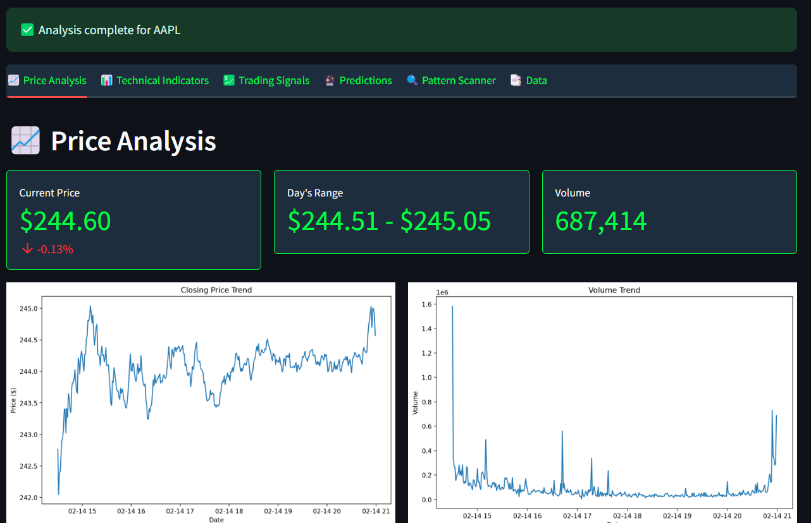
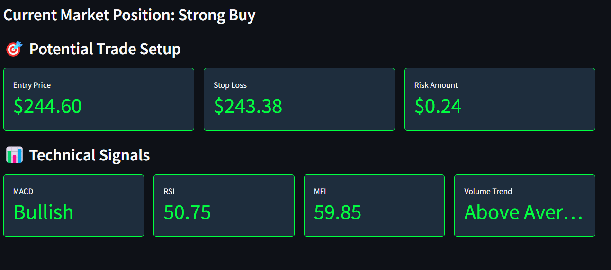
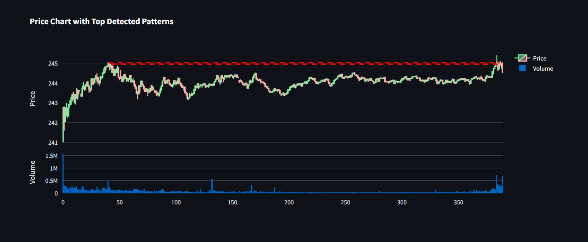
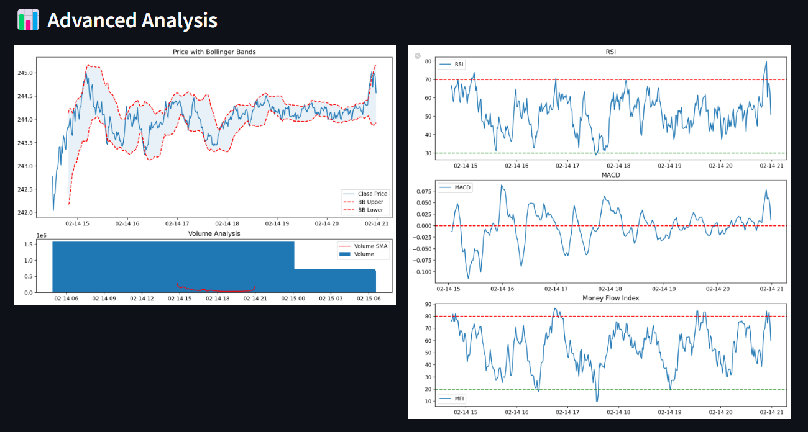
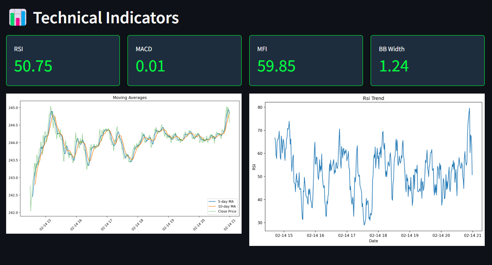
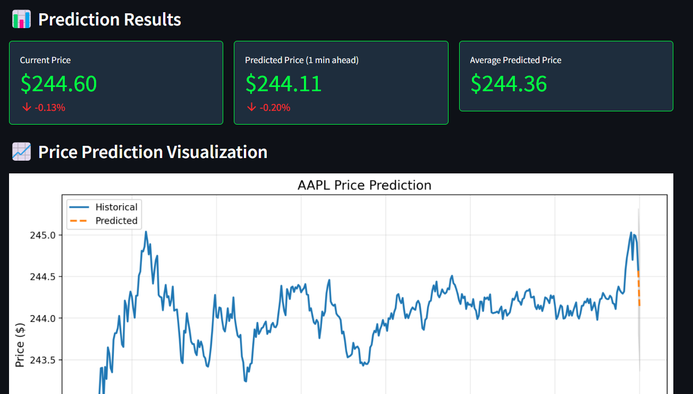
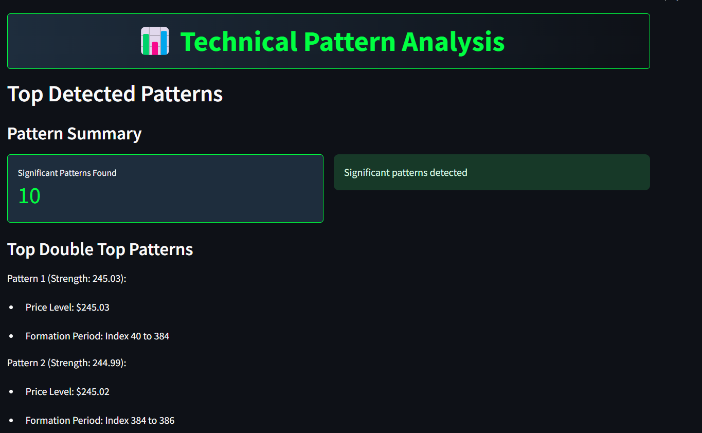
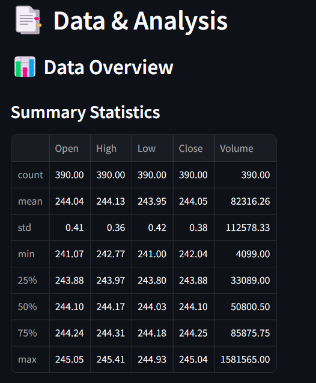

# 🔮 Advanced Stock Price Prediction Pro

## Experience AI-Powered Stock Analysis & Prediction

A sophisticated platform that transforms complex market data into actionable investment insights through advanced AI, real-time analytics, and intelligent portfolio management.

  

 

  <table>
    <tr>
      <td width="33%">
        
        
<b>Real-time Analytics</b>

      </td>
      <td width="33%">
        
        
<b>AI Trading Signals</b>

      </td>
      <td width="33%">
        
        
<b>Portfolio Management</b>

      </td>
    </tr>
  </table>

---

## 🌟 Features that Set Us Apart

<b>🎨 Intuitive Analytics Dashboard</b>

 
Experience financial data through an elegant, user-centric interface designed for both novice and professional investors. Our responsive dashboard puts critical market insights at your fingertips.

<b>📊 Dynamic Visualization Engine</b>

 
Explore interactive charts with real-time trends, customizable parameters, and comprehensive visualization options that bring complex market data to life.

<b>🔬 Deep Market Analysis</b>

 
Unlock profound insights into stock behavior through multi-dimensional analysis of historical patterns, volatility metrics, and market correlations.

<b>📈 Professional Technical Indicators</b>

 
Access a comprehensive suite of technical analysis tools including RSI, MACD, Bollinger Bands, and custom moving averages—all configurable to your trading strategy.

<b>🤖 AI-Driven Trading Intelligence</b>

 
Leverage cutting-edge artificial intelligence to generate precise buy, sell, and hold signals backed by advanced predictive algorithms and pattern recognition.

<b>🧠 Multi-Model Machine Learning</b>

 
Benefit from ensemble predictions powered by SVM, KNN, Decision Trees, Random Forest, XGBoost, and other advanced models, continuously refined with real-time market data.

<b>👁️ Advanced Pattern Recognition</b>

 
Identify critical chart patterns with precision—from Head & Shoulders to Fibonacci retracements—using our proprietary AI-assisted recognition algorithms.

<b>💼 Comprehensive Portfolio Management</b>

 
Take control of your investments with integrated tools for tracking holdings, optimizing allocations, implementing stop-loss strategies, and quantifying risk exposure.

<b>📊 Real-Time Market Statistics</b>

 
Stay informed with instant access to key market metrics, sentiment indicators, and volatility assessments that drive successful trading decisions.

## 🚀 Getting Started in 4 Simple Steps

1. **Select Your Asset** — Enter any supported stock symbol (e.g., AAPL, MSFT, TSLA)
2. **Define Your Horizon** — Select your preferred timeframe for analysis and prediction
3. **Set Risk Parameters** — Customize risk tolerance and position sizing settings
4. **Generate Insights** — Activate the AI engine to produce comprehensive analytics

## ⚙️ Technology Stack

<table>
  <tr>
    <td><b>Core Platform</b></td>
    <td>Python, Streamlit</td>
  </tr>
  <tr>
    <td><b>AI & Machine Learning</b></td>
    <td>SVM, KNN, Decision Trees, Random Forest, XGBoost, CatBoost, Linear Regression</td>
  </tr>
  <tr>
    <td><b>Data Processing</b></td>
    <td>pandas, NumPy, scikit-learn, statsmodels</td>
  </tr>
  <tr>
    <td><b>Market Data</b></td>
    <td>yfinance, Alpha Vantage API, Yahoo Finance API</td>
  </tr>
  <tr>
    <td><b>Visualization</b></td>
    <td>Plotly, Matplotlib, Seaborn</td>
  </tr>
  <tr>
    <td><b>Technical Analysis</b></td>
    <td>ta (Technical Analysis Library)</td>
  </tr>
  <tr>
    <td><b>Risk Management</b></td>
    <td>Proprietary Backtesting Engine, Custom Risk Models</td>
  </tr>
</table>

## 🔮 Future Development Roadmap

| Feature | Description | Priority |
|---------|-------------|----------|
| **Sentiment Analysis Engine** | Real-time analysis of news, social media, and market sentiment | 🔴 High |
| **Financial News Integration** | Curated financial news directly related to portfolio assets | 🔴 High |
| **AI Trading Assistant** | Personalized trade recommendations with confidence ratings | 🔴 High |
| **Advanced Portfolio Optimization** | Deep learning models for maximum return/risk optimization | 🟠 Medium |
| **Enhanced Backtesting** | Multi-scenario testing with variable market conditions | 🟠 Medium |
| **Automated Trading** | Direct execution capabilities through brokerage APIs | 🟠 Medium |
| **Smart Notification System** | Configurable alerts for price movements and pattern emergence | 🟢 Planned |
| **Custom Dashboard Layouts** | User-configurable interface with drag-and-drop components | 🟢 Planned |
| **Multi-Asset Expansion** | Support for cryptocurrencies, forex, and commodities | 🟢 Planned |
| **Predictive Risk Assessment** | AI-driven forecasting of market volatility and downside risk | 🟢 Planned |

## 🔒 License

This project is proprietary software. All rights reserved. Unauthorized copying, distribution, or use is strictly prohibited.

## 👨‍💻 Created By

  
   
  
  

---

  <i>Transforming market data into profitable decisions</i>

