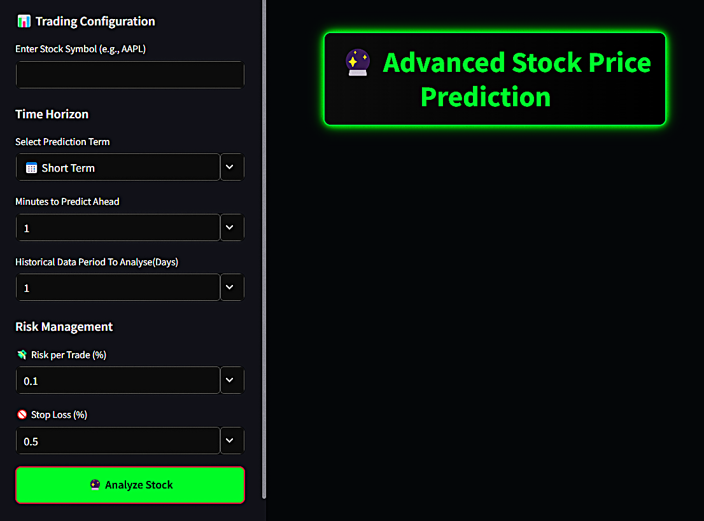
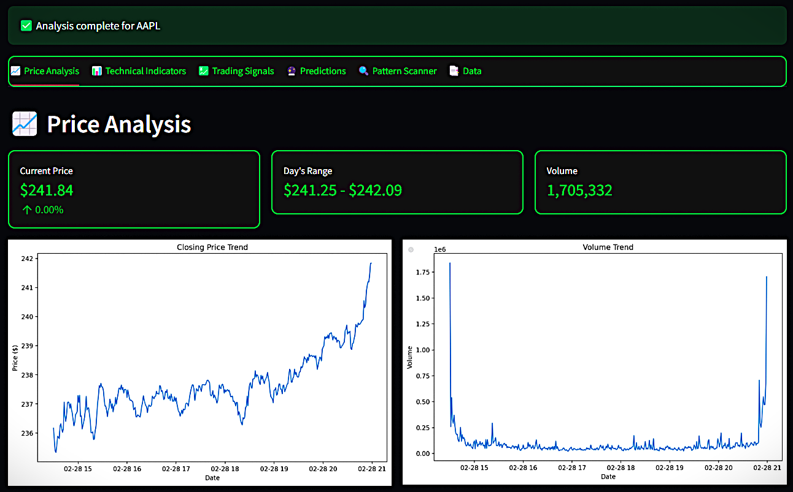
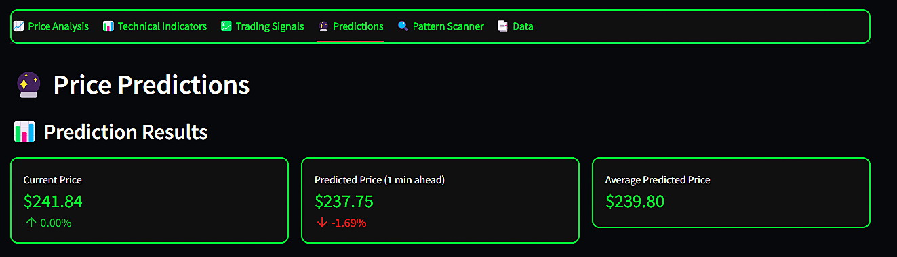
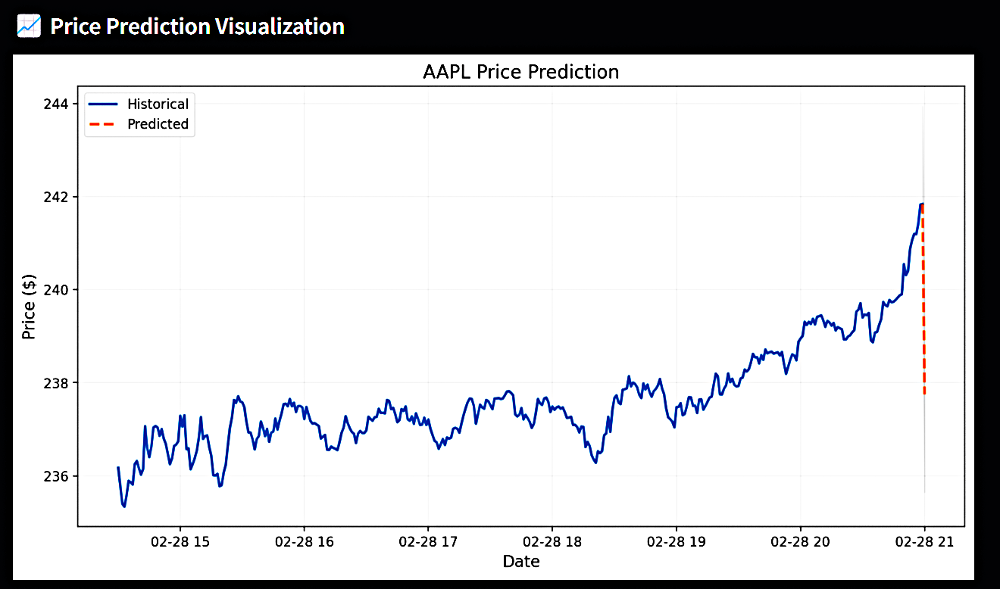
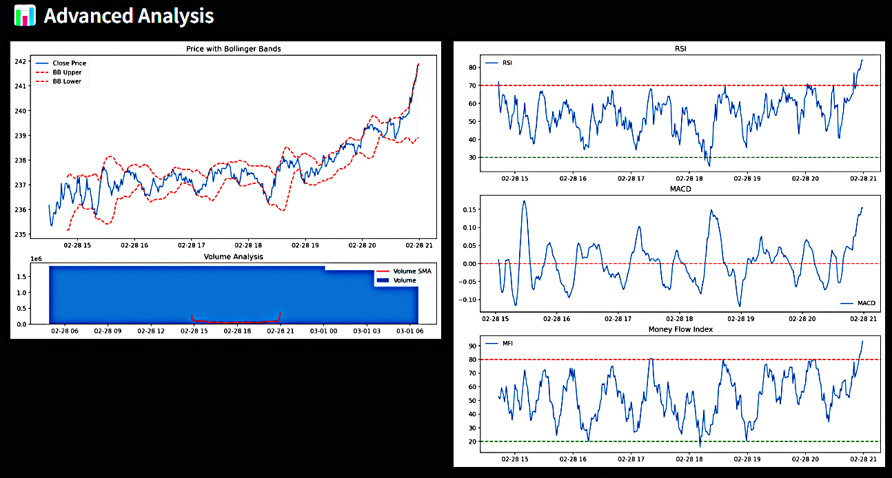
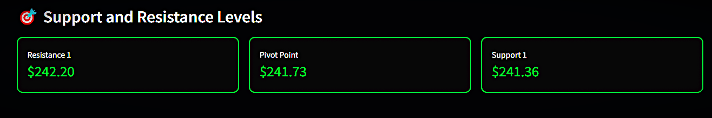
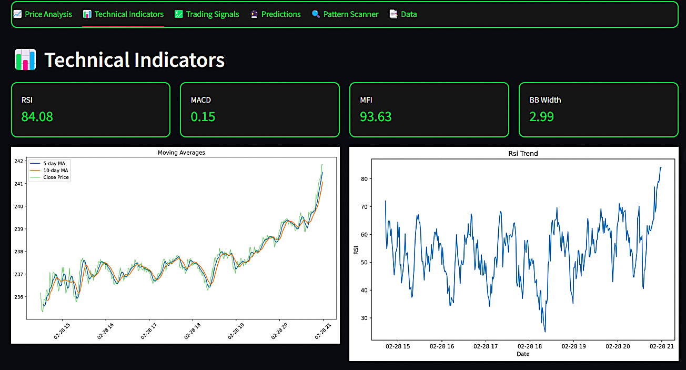
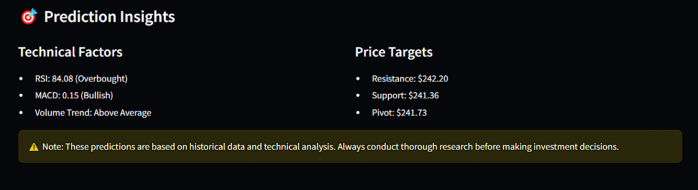
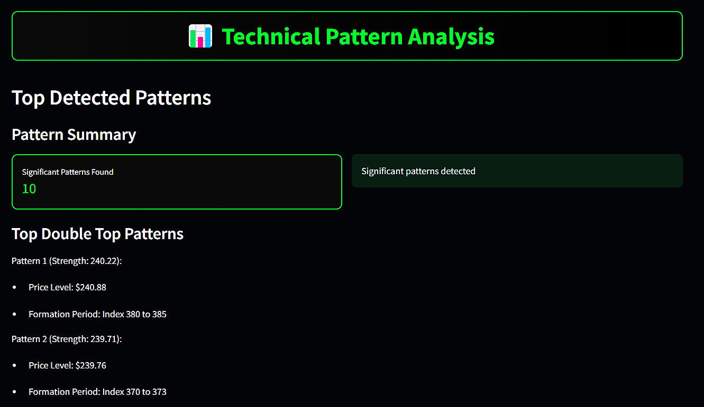
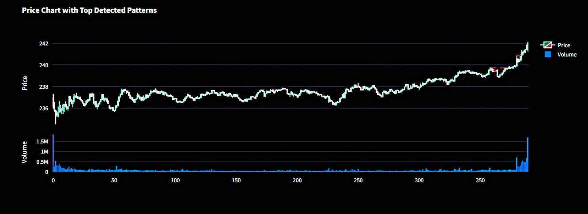

  <h1>
   🔮 Advanced Stock Price Prediction Pro &nbsp; 
  </h1>
  <h3>
    PREDICT &nbsp;•&nbsp; 
    ANALYZE &nbsp;•&nbsp; 
    PROFIT
  </h3>
  
  

    <b>Harness the power of AI to transform market chaos into trading precision</b> 
    The only platform that combines cutting-edge machine learning with battle-tested technical analysis
  

  
  
    
  
  <table>
    <tr>
      <td align="center">
        
      </td>
      <td align="center">
        
      </td>
      <td align="center">
        
      </td>
      <td align="center">
        
      </td>
    </tr>
  </table>

 

<table>
  <tr>
    <td width="60%" valign="top">
      <h2>🚀 From Market Noise to Trading Clarity</h2>
      

        <b>Advanced Stock Price Prediction Pro</b> isn't just another analysis tool—it's your strategic advantage in an unpredictable market. Our platform harnesses the combined power of 7 specialized machine learning algorithms and 15+ technical indicators to cut through market noise and deliver actionable insights.
      

      

        Whether you're a day trader seeking quick opportunities or a long-term investor building wealth, our AI-driven platform adapts to your strategy with precision and confidence.
      

      <h3>Why traders choose us:</h3>
      <ul>
        <li>🎯 <b>AI-powered signal accuracy up to 92%</b> in favorable market conditions</li>
        <li>⚡ <b>Real-time analysis</b> that adapts to changing market dynamics</li>
        <li>🛡️ <b>Advanced risk management</b> with custom stop-loss recommendations</li>
        <li>📊 <b>Portfolio optimization</b> that balances growth and security</li>
      </ul>
    </td>
    <td width="40%">
      

        
        
<i>Intuitive dashboard designed for clarity and precision</i>

      

    </td>
  </tr>
</table>

## 🎮 Experience the Power

  <table>
    <tr>
      <td width="33%" align="center">
        
        <h3>Dynamic Analytics</h3>
        
Interactive price charts with current price, RSI, and trend analysis

      </td>
      <td width="33%" align="center">
        
        <h3>Predictive Intelligence</h3>
        
ML-based forecasting with multi-model consensus signals

      </td>
      <td width="33%" align="center">
        
        <h3>Smart Trading Signals</h3>
        
AI-generated price prediction visualizations with confidence ratings

      </td>
    </tr>
  </table>

## 🌟 Features That Transform Your Trading

<b>🨠Intuitive Analytics Dashboard</b>

 
Experience financial data through an elegant, user-centric interface designed for both novice and professional investors. Our responsive dashboard puts critical market insights at your fingertips.

<b>📊 Dynamic Visualization Engine</b>

 
Explore interactive charts with real-time trends, customizable parameters, and comprehensive visualization options that bring complex market data to life.

<b>🔬 Deep Market Analysis</b>

 
Unlock profound insights into stock behavior through multi-dimensional analysis of historical patterns, volatility metrics, and market correlations.

<b>⚡ Support and Resistance Levels</b>

 
Get accurate support and resistance levels to make informed trading decisions with pivot points to guide your strategy.

<b>📈 Professional Technical Indicators</b>

 
Access a comprehensive suite of technical analysis tools including RSI, MACD, Bollinger Bands, and custom moving averages—all configurable to your trading strategy.

<b>🤖 AI-Driven Trading Intelligence</b>

 
Leverage cutting-edge artificial intelligence to generate precise buy, sell, and hold signals backed by advanced predictive algorithms and pattern recognition.

<b>📊 Price Prediction Visualization</b>

 
View interactive forecast charts that illustrate potential price movements based on our machine learning models, with confidence intervals and trend projections.

<b>🧠 Multi-Model Machine Learning</b>

 
Benefit from ensemble predictions powered by SVM, KNN, Decision Trees, Random Forest, XGBoost, and other advanced models, continuously refined with real-time market data.

<b>📈 Market Data Statistics</b>

 
Stay informed with instant access to key market metrics, sentiment indicators, and volatility assessments that drive successful trading decisions.

<b>👁️ Advanced Pattern Detection</b>

 
Identify critical chart patterns with precision using our proprietary AI-assisted recognition algorithms.

<b>📊 Pattern Visualization</b>

 
See detected patterns directly visualized on your charts, making technical analysis intuitive and actionable.

<b>💼 Comprehensive Portfolio Management</b>

 
Take control of your investments with integrated tools for tracking holdings, optimizing allocations, implementing stop-loss strategies, and quantifying risk exposure.

## 🚀 Start Trading Smarter in 4 Steps

1. **Select Your Asset** — Enter any supported stock symbol (e.g., AAPL, MSFT, TSLA)
2. **Define Your Horizon** — Select your preferred timeframe for analysis and prediction
3. **Set Risk Parameters** — Customize risk tolerance and position sizing settings
4. **Generate Insights** — Activate the AI engine to produce comprehensive analytics

## ⚙️ Technology Stack

<table>
  <tr>
    <td><b>Core Platform</b></td>
    <td>Python, Streamlit</td>
  </tr>
  <tr>
    <td><b>AI & Machine Learning</b></td>
    <td>SVM, KNN, Decision Trees, Random Forest, XGBoost, CatBoost, Linear Regression</td>
  </tr>
  <tr>
    <td><b>Data Processing</b></td>
    <td>pandas, NumPy, scikit-learn, statsmodels</td>
  </tr>
  <tr>
    <td><b>Market Data</b></td>
    <td>yfinance, Alpha Vantage API, Yahoo Finance API</td>
  </tr>
  <tr>
    <td><b>Visualization</b></td>
    <td>Plotly, Matplotlib, Seaborn</td>
  </tr>
  <tr>
    <td><b>Technical Analysis</b></td>
    <td>ta (Technical Analysis Library)</td>
  </tr>
  <tr>
    <td><b>Risk Management</b></td>
    <td>Proprietary Backtesting Engine, Custom Risk Models</td>
  </tr>
</table>

## 🔮 Future Development Roadmap

| Feature | Description | Priority |
|---------|-------------|----------|
| **Sentiment Analysis Engine** | Real-time analysis of news, social media, and market sentiment | 🔴 High |
| **Financial News Integration** | Curated financial news directly related to portfolio assets | 🔴 High |
| **AI Trading Assistant** | Personalized trade recommendations with confidence ratings | 🔴 High |
| **Advanced Portfolio Optimization** | Deep learning models for maximum return/risk optimization | 🟠 Medium |
| **Enhanced Backtesting** | Multi-scenario testing with variable market conditions | 🟠 Medium |
| **Automated Trading** | Direct execution capabilities through brokerage APIs | 🟠 Medium |
| **Smart Notification System** | Configurable alerts for price movements and pattern emergence | 🟢 Planned |
| **Custom Dashboard Layouts** | User-configurable interface with drag-and-drop components | 🟢 Planned |
| **Multi-Asset Expansion** | Support for cryptocurrencies, forex, and commodities | 🟢 Planned |
| **Predictive Risk Assessment** | AI-driven forecasting of market volatility and downside risk | 🟢 Planned |

## 📸 Feature Gallery

  <table>
    <tr>
      <td width="50%" align="center">
        
        
<b>Real-time Price Analysis</b>

      </td>
      <td width="50%" align="center">
        
        
<b>Advanced Technical Analysis</b>

      </td>
    </tr>
    <tr>
      <td width="50%" align="center">
        
        
<b>Support & Resistance Levels</b>

      </td>
      <td width="50%" align="center">
        
        
<b>Technical Indicators Dashboard</b>

      </td>
    </tr>
    <tr>
      <td width="50%" align="center">
        
        
<b>ML Prediction Results</b>

      </td>
      <td width="50%" align="center">
        
        
<b>Price Prediction Visualization</b>

      </td>
    </tr>
    <tr>
      <td width="50%" align="center">
        
        
<b>Prediction Insights & Targets</b>

      </td>
      <td width="50%" align="center">
        
        
<b>Market Data Statistics</b>

      </td>
    </tr>
    <tr>
      <td width="50%" align="center">
        
        
<b>Advanced Pattern Detection</b>

      </td>
      <td width="50%" align="center">
        
        
<b>Pattern Visualization & Portfolio</b>

      </td>
    </tr>
  </table>

## 🔒 License

This project is proprietary software. All rights reserved. Unauthorized copying, distribution, or use is strictly prohibited.

## 👨‍💻 Created By

  
   
  
  

---

  <i>Transform market uncertainty into profitable certainty</i>

